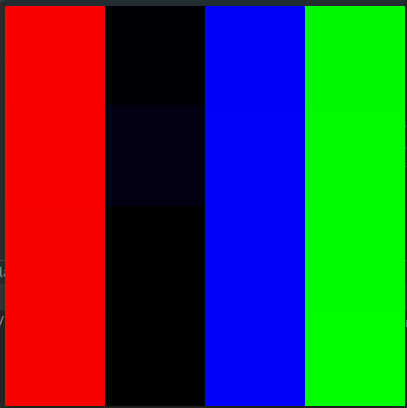

# Scale Sets

This is an implementation based on the paper
[Scale-Sets Image Analysis](https://www.hds.utc.fr/~cocquere/dokuwiki/_media/fr/scale-sets_ijcv06.pdf)
by LAURENT GUIGUES, JEAN PIERRE COCQUEREZ and HERVÉ LE MEN,  
which talks about the segmentation of an image based on the scale-sets representation.

## Requirements

- [opencv](https://docs.opencv.org/4.7.0/d7/d9f/tutorial_linux_install.html)
- [argparse](https://github.com/p-ranav/argparse#building-installing-and-testing)

## Usage

```
Usage: scale set [--help] [--version] image budget

Scale set segmentation algorithm

Positional arguments:
  image         path to input image 
  budget        number of maximum merge allowed by user 

Optional arguments:
  -h, --help    shows help message and exits 
  -v, --version prints version information and exits 
```

```bash
./scale-sets example.jpg 500
```

## Algorithm

The scale-sets representation consists of segmenting the image into a set of regions,
which is a combination of smaller regions that depend on budget set by the user.  
The number of merges is determined by this budget.

The combination of two regions is determined by comparing their energies.  
A region will merge with another region if the resulting energy is lower than the one of any other possible
combination.  
Here, the energy of a region is its variance, plus its perimeter multiplied by the lambda factor.

The algorithm starts by creating a region for each pixel in the image.  
Then, it iterates over all the regions to merge them with the constraint describe above.

The possible merges are stored in a priority queue, which is sorted by the energy of the resulting region.  
The merges are done in order of this priority queue, starting with the merge which has the lowest energy.

Regions are stored in a disjoint set, which allows to keep track of the parent of each region,
while searching for them in a reasonable amount of time.

The complexity of the algorithm is complicated to find but annotations can be found in the code.

## Example

Here is a working example for our algorithm :




